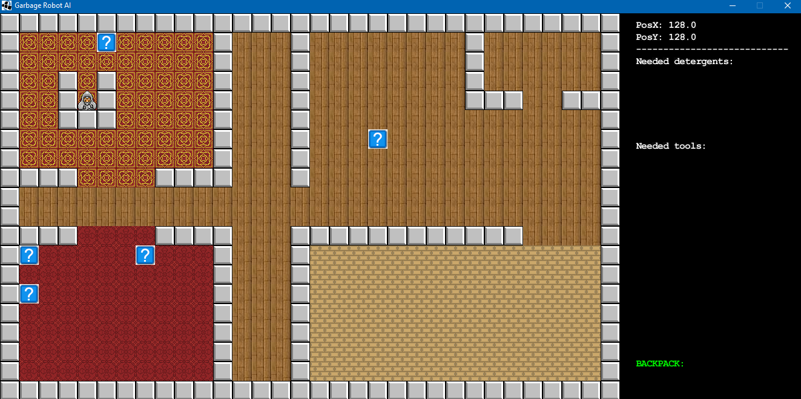

# AI-Garbage-Robot
Smart Garbage Robot Detector app. Created at the University as the project within Artificial Intelligence classes in 2015. The purpose of this project was to learn AI strategies and to create app uses those features.

## App
Smart Garbage Robot Detector is focued on the AI strategies by showing the world of the rubbish. There are some rubbish on the map. Every garbage is described by a lot of information. Thanks to this information, each rubbish is assign to the specific type. Also the robot gets know which cleaning products and tools are required to clean the garbage. Sorting to garbage to trash is also included. Robot can be controlled manually by the user or just walk automatically by the algorithm.

### Strategies
In this app some AI strategies have been applied. These are among others: learning decision trees (using Weka), neural networks (using Fann), informed search of the state space A*.

### Keys
- Arrows: to control robot  
- N: new game
- G: auto walk
- C: clean stain

### Screenshots
Screenshots shows the world of the AI Garbage Robot. For more see [screenshots](screenshots) folder. There are also videos.

  
